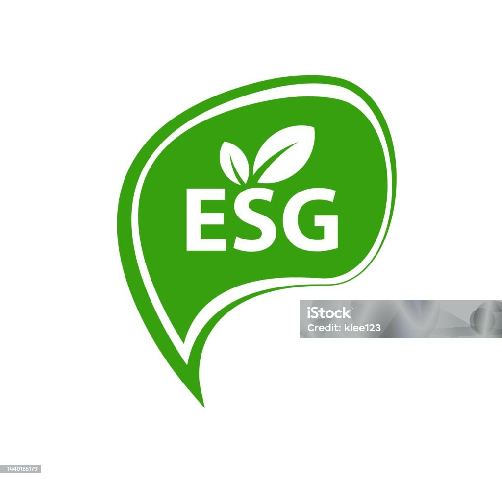

# 🌱 Emil Roby – Your ESG Enthusiast & Analyst  
**Championing Sustainability | Mastering ESG Analysis | Navigating Corporate Finance | Data Analytics Aficionado**  

 <!-- Replace with your banner image link -->

---

## 👋 Welcome to My Corner of the Internet!  
Hey there! I’m Emil, an ESG enthusiast on a mission to merge finance and sustainability! 🌍✨  
I love diving into complex data to uncover insights that drive transparency and accountability in business.

### What You’ll Find Here:
- **🔍 ESG Insights**: Explore the latest trends and best practices.  
- **📚 Book Reviews**: Check out my favorite reads that inspire my journey.  
- **💡 Project Highlights**: Discover the projects that fuel my passion for sustainability.  

 <!-- Replace with your ESG-related image link -->

---

## 📝 Blog – My Thoughts & Discoveries  
Welcome to my blog—a vibrant tapestry of ideas, insights, and inspirations! Here, I dive into a variety of topics that spark my curiosity and ignite my passion for sustainability and beyond. Expect to find:  

- 📚 **Book Reviews**: Unpacking the wisdom of transformative reads.  
- 🌱 **ESG Insights**: Exploring the latest trends in sustainability.  
- 💡 **Project Learnings**: Chronicles of my experiences.  
- 🧠 **Personal Reflections**: My musings and suggestions.  

 <!-- Replace with your blog-related image link -->

---

## 🌍 ESG Reporting Standards I Know  
I’m well-versed in the following reporting standards, empowering me to navigate the complexities of sustainability:  

- **📊 TCFD**: Task Force on Climate-related Financial Disclosures  
- **🌍 SBTi**: Science-Based Targets initiative  
- **📄 CSRD**: Corporate Sustainability Reporting Directive  
- **📑 ESRS**: European Sustainability Reporting Standards  
- **📊 BRSR**: Business Responsibility and Sustainability Report  

 <!-- Replace with your standards-related image link -->

---

## 🛠️ Skills  
Here's what I bring to the table:  

- **Data Analytics**: Power BI, Tableau  
- **Programming**: Python (for data analysis)  
- **Reporting**: ESG metrics, sustainability frameworks, financial analysis  

 <!-- Replace with your skills-related image link -->

---

## 🚀 Join Me on This Journey!  
Together, let’s explore the intersections of knowledge, sustainability, and personal growth!  
Feel free to connect with me on [LinkedIn](https://www.linkedin.com/in/yourprofile) or follow my journey!

 <!-- Replace with your connect-related image link -->

---

# Feel free to reach out to me:
- 📧 **Email**: [emilroby9@gmail.com](mailto:emilroby9@gmail.com)
- 🔗 **LinkedIn**: [Emil Roby's LinkedIn](https://www.linkedin.com/in/emil-roby-878792314/)
- 📞 **Phone**: +91 8301826142

---
Thank you for visiting!  
Let’s build a sustainable future together 🌍.
