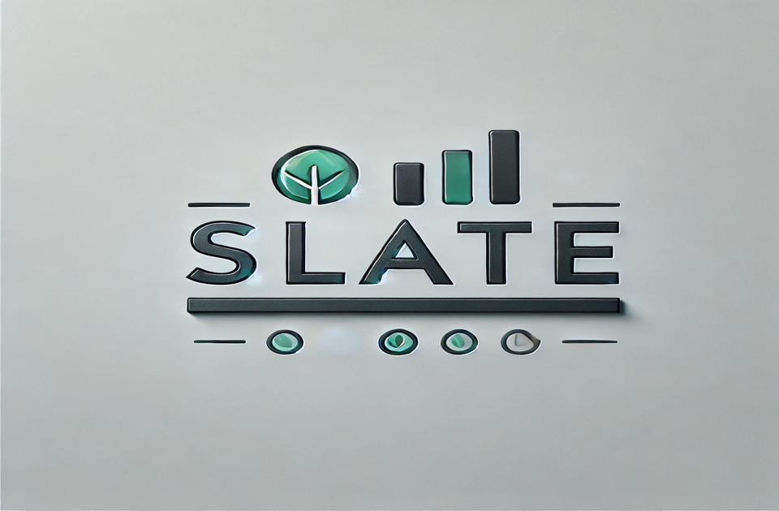
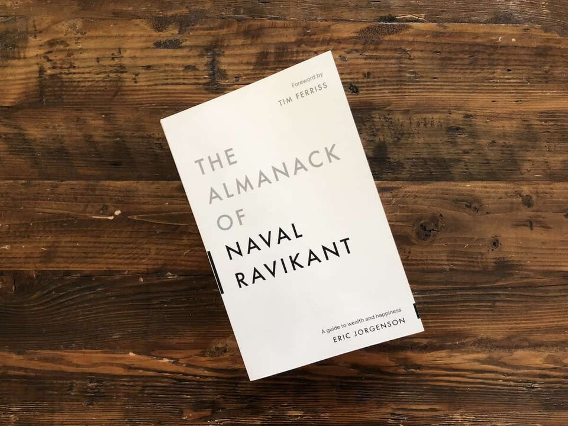
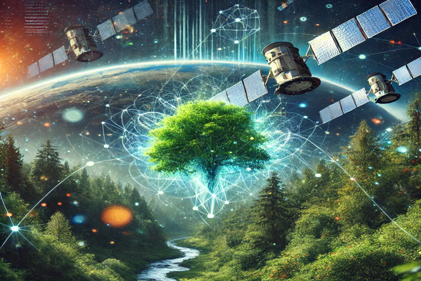

# Slate
_A space where thoughts evolve, ideas grow, and writing finds its form._

---

## 👋 Welcome to My Corner of the Internet!  
Hey there! I’m Emil, an ESG enthusiast on a mission to merge finance and sustainability! 🌍✨  
This blog is my space where thoughts evolve, ideas grow, and stories take shape. Here, I share my journey of blending the worlds of sustainability, finance, and personal development—uncovering insights, exploring new concepts, and sharing projects that fuel my passion for making an impact.

## What You’ll Find Here:
- **🌱 ESG Insights**: Dive into my thoughts on sustainable practices, the latest trends in ESG, and how we can build a more transparent and accountable world.
- **📊 Finance & Sustainability**: Explore how finance and ESG can work together to drive meaningful change, with a focus on integration, risks, and opportunities in the corporate world.
- **💡 Personal Growth & Projects**: Discover the projects that inspire my work and my personal reflections on the journey of continuous improvement and learning.
- **📚 Book Reviews & Recommendations**: Check out my favorite reads that inspire both my professional and personal growth in the ESG space. 

---

## 📝 Blog – My Thoughts & Discoveries  
Welcome to my blog—a vibrant tapestry of ideas, insights, and inspirations! Here, I dive into a variety of topics that spark my curiosity and ignite my passion for sustainability and beyond. Expect to find:  

# Bridging Finance and Sustainability: My Vision for a Greener Tomorrow

**Introduction**  
Growing up, I was always fascinated by the power of finance—not just as a tool for wealth creation but as a driver of change. However, it was during my work on analyzing climate change’s impact on industries that I realized the true potential of finance to address the world's most pressing challenges. The intersection of financial decision-making and sustainability sparked a passion that has since guided my career aspirations.

---

**The Importance of ESG in Finance**  
The global shift towards sustainability is no longer optional; it’s essential. Environmental, Social, and Governance (ESG) metrics have become the backbone of responsible investing and long-term corporate growth. Organizations are increasingly judged not only on their financial returns but also on their ability to create a positive environmental and social impact. From mitigating climate risks to ensuring equitable labor practices, ESG principles are redefining how businesses operate and succeed.

Yet, for many emerging markets and growing industries, ESG integration remains a complex challenge. Financial professionals must step up to bridge this gap—quantifying risks, evaluating opportunities, and driving strategies that align profitability with sustainability.

---

**My Perspective**  
In my research on ESG integration in emerging markets, I found that sectors like agriculture and renewable energy could benefit immensely from sustainable practices. For instance, incorporating climate resilience strategies not only safeguards crops but also creates value for investors and communities alike. Similarly, infrastructure investments with a focus on sustainability can amplify industrial growth while minimizing environmental degradation.

I believe that the synergy between finance and ESG is more than a moral obligation; it’s an economic imperative. As companies and nations adopt frameworks like TCFD and SBTi, they’re unlocking new avenues for innovation and competitive advantage.

A key example of this is India’s renewable energy sector, where ESG-focused financing has spurred rapid growth while setting benchmarks for green investment globally. By leveraging data-driven insights and robust reporting standards, we can replicate such success stories across diverse industries.

---

**Looking Ahead**  
As I embark on my MBA journey, my goal is to deepen my expertise in financial analysis and ESG frameworks, preparing myself to tackle real-world challenges in sustainability. I envision a future where financial models fully account for ESG risks and opportunities, enabling industries to grow responsibly while contributing to a greener planet.

Through this blog, I aim to share ideas, spark discussions, and build a community of like-minded individuals who believe in the transformative power of finance and sustainability. Together, we can redefine what it means to create value—for businesses, communities, and the planet.

---

What’s your take on the role of finance in shaping a sustainable future? I’d love to hear your thoughts—drop your ideas in the comments or connect with me to discuss further!

# The Art of Inner Silence: Lessons from *The Almanack of Naval Ravikant*

I have never really been a fan of self-help books. It’s not that I doubt their effectiveness—they’ve worked for millions—but the generic advice they offer never quite resonates with me. I prefer learning from personal conversations with people who’ve faced situations similar to mine. However, a recommendation from a friend and a sleepless night led me to pick up *The Almanack of Naval Ravikant: A Guide to Wealth and Happiness*. Surprisingly, it left a lasting impression.

What sets this book apart is that it doesn’t promise a magic bullet. It’s not about rigid life templates like “wake up at 5 AM and all your problems will vanish.” Instead, Naval shares his personal insights, leaving readers the freedom to pick and choose what works for them. It’s a collection of timeless wisdom, applicable to anyone willing to reflect and adapt.

## Key Takeaways

### Part 1: Wealth

**Building Wealth:**
- **Productize Yourself:** Redefine your unique skills until you become the best in the world at what you do.
- **Leverage Specific Knowledge:** Master something that cannot be easily taught but can be learned through experience and passion.
- **Play Long-Term Games:** True rewards—whether in wealth, relationships, or knowledge—come from compounding over time.
- **Intentions Don’t Matter; Actions Do:** Embrace accountability and take calculated risks.

**Building Judgment:**
- Reality triumphs wishful thinking. Suffering often reveals truth.
- Praise specifically, criticize generally.
- Learn to love reading—it’s a gateway to endless growth.

### Part 2: Happiness

- **Happiness is Subtraction:** It’s what remains when you stop feeling that something is missing.
- **Accept Mortality:** Recognize that none of this will matter in the long run. Focus on living fully in the present.
- **Easy Choices Lead to Hard Lives; Hard Choices Lead to Easy Lives:** Opt for actions like exercise and healthy eating—they pay off in the long term.
- **Health, Love, and Mission:** Prioritize these three elements, in that order.

## My Experience

One idea that deeply resonated with me is the importance of controlling the inner voices in your head. Our minds are perpetually noisy, juggling worries, regrets, and endless distractions. Naval advocates for quieting this mental chatter—not by force but through mindfulness and acceptance.

### Strategies for Inner Silence:
1. **Mindfulness Meditation:** Spend a few minutes observing your breath to anchor yourself to the present moment.
2. **Focus on One Task:** Single-tasking enhances both productivity and peace.
3. **Limit Information Overload:** Be selective about what you consume; it reduces mental clutter.
4. **Self-Reflection:** Journaling or introspecting helps process emotions and clear your mind.

Since adopting these practices, I feel more present, less anxious, and surprisingly productive. Even mundane moments like enjoying a cup of tea feel richer and more fulfilling.

## Final Thoughts

*The Almanack of Naval Ravikant* changed my perspective on self-help literature. It isn’t about preaching; it’s about sharing. It connects with readers by offering insights they can relate to and adapt. For anyone hesitant about self-help books, this one might just surprise you—just as it did me.

# Harnessing Technology for Ecology: My Experience with ISRO’s Deep Learning Training

In today’s world, where environmental challenges demand innovative solutions, technology plays a pivotal role in reshaping ecological studies. I recently had the privilege of participating in the **Deep Learning in Ecological Studies** online training program offered by the **Indian Space Research Organisation (ISRO)** through its **Indian Institute of Remote Sensing (IIRS)**. This free training and certification initiative reflects ISRO’s commitment to fostering learning and equipping individuals with cutting-edge tools to address real-world challenges.

## The Opportunity

ISRO’s program stands out as a remarkable initiative, providing access to specialized knowledge on how deep learning techniques can be applied to ecological studies. Open to enthusiasts from diverse backgrounds, this program is a testament to ISRO’s mission of democratizing access to advanced technological education, encouraging individuals to think critically about integrating artificial intelligence into environmental research.

## My Learnings

As an ESG enthusiast deeply invested in sustainability and environmental impact, this training was an eye-opener. The program delved into key areas such as:

- **The Role of Remote Sensing in Ecology:** Understanding how satellite imagery and geospatial data can be harnessed for biodiversity monitoring and habitat analysis.
- **Deep Learning Techniques:** Exploring neural networks and machine learning models to analyze complex ecological datasets.
- **Practical Applications:** Insights into real-world case studies where technology has helped in species identification, forest mapping, and climate change impact assessments.

This knowledge enriched my ongoing research, where I am exploring **ESG integration in emerging markets**. The tools and techniques I gained through ISRO’s program are invaluable for creating robust, data-driven policies for sustainability.

## Looking Ahead

This experience has inspired me to further bridge the gap between technology and sustainability. By leveraging these advanced tools, I aim to contribute meaningfully to ecological studies and ESG frameworks. Programs like these not only enhance individual skillsets but also open doors to innovative career opportunities in sustainability and environmental management.

## Gratitude

I extend my gratitude to ISRO and IIRS for this exceptional learning experience. Their initiative underscores the importance of empowering individuals with knowledge to tackle global challenges, proving that technology and sustainability can indeed go hand in hand.

If you’re passionate about ecology or technology, I highly recommend exploring such opportunities to make a difference in this rapidly evolving field.

---

## 🌍 ESG Reporting Standards I Know  
I’m well-versed in the following reporting standards, empowering me to navigate the complexities of sustainability:  

- **📊 TCFD**: Task Force on Climate-related Financial Disclosures  
- **🌍 SBTi**: Science-Based Targets initiative  
- **📄 CSRD**: Corporate Sustainability Reporting Directive  
- **📑 ESRS**: European Sustainability Reporting Standards  
- **📊 BRSR**: Business Responsibility and Sustainability Report  

---

## 🛠️ Skills  
Here's what I bring to the table:  

- **Data Analytics**: Power BI, Tableau  
- **Programming**: Python (for data analysis)  
- **Reporting**: ESG metrics, sustainability frameworks, financial analysis  

---

## 🚀 Join Me on This Journey!  
Together, let’s explore the intersections of knowledge, sustainability, and personal growth!  
Feel free to connect with me on [LinkedIn](https://www.linkedin.com/in/yourprofile) or follow my journey!

## Thank You for Visiting!
I’m glad you’re here! I hope this space provides you with fresh perspectives, inspiring ideas, and sparks of creativity that resonate with your own journey. Feel free to explore, engage, and connect with me through comments or on my social media links below.

---

# Feel free to reach out to me:
- 📧 **Email**: [emilroby9@gmail.com](mailto:emilroby9@gmail.com)
- 🔗 **LinkedIn**: [Emil Roby's LinkedIn](https://www.linkedin.com/in/emil-roby-878792314/)
- 📞 **Phone**: +91 8301826142

---

