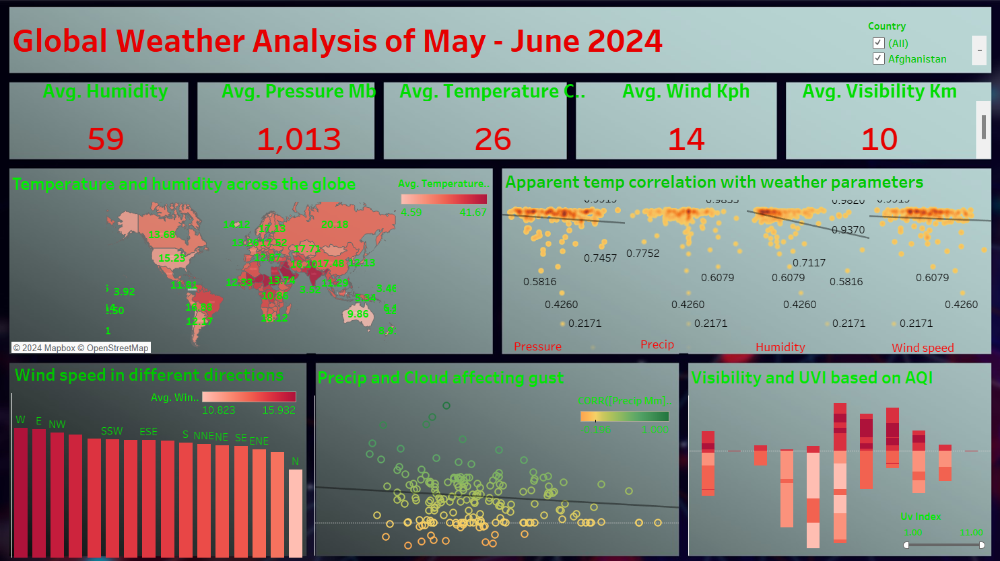
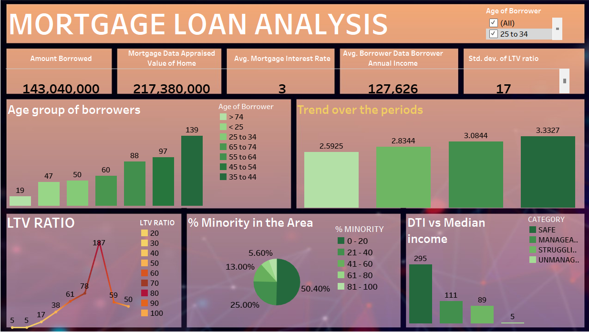

# Welcome to my Data Analytics Portfolio

# Hi, I'm Emil Roby!
🌍📊 Passionate Data Analyst with a focus on ESG and Finance 📈💼
Welcome to my GitHub portfolio! I specialize in leveraging data analytics to drive insights in the dynamic fields of Environmental, Social, Governance (ESG) criteria and finance.  Let's uncover impactful data-driven solutions together!!!

## Skills
**Languages & Libraries**
- Python (Pandas, NumPy, Seaborn, Matplotlib, ) |  SQL | R (ggplot2, qplot)

**Visualization Tools**
- Power BI | Tableau | IBM Cognos Analytics | Alteryx | Google Looker Studio | MS Excel

# Hands on Experience

## Individual Projects
Here is some examples of the projects that I have done

**Global Weather Analysis for the month of May &  June 2024(_June 2024_)**
- Conducted a detailed analysis on global weather data for May and June 2024 using Python, focusing on temperature, humidity, wind speed, precipitation, and air quality. Prepared a comprehensive dashboard in Tableau, revealing that average global temperature was 25.6°C.
- Identified climatic patterns: Southeast Asia and Sub-Saharan Africa experienced extremely high temperatures (30-40°C), while Northern Americas and Australia had significantly lower temperatures.
- Mapped cyclone proximity by correlating average temperature, pressure, and wind speed, identifying high-risk regions like Japan, Bangladesh, Burundi, and Fiji Islands with pressures well below the global average of 1013 mb.
- Analyzed wind speed variations, finding that the highest speeds were in the west and the lowest in the north, indicating pressure variations in these directions.
- Found strong correlations (~1) between visibility, cloud cover, and precipitation, along with significant air quality issues in many countries, highlighting the urgent need for sustainable development.
- Discovered a near-perfect correlation (~1) between air quality issues and UV radiation, emphasizing the importance of promoting sustainable finance and a circular economy to address these challenges globally.

I have used pyplot library for visualiztion which is under MIT License and the dataset was obtained from Kaggle.

[Python Code](codes/Global_Weather_Analysis_May_June_2024.ipynb)

**World Economic Outlook 2022 from IMF (_June_2024_)**
- Developed a comprehensive Tableau dashboard presenting the World Economic Outlook of 2022, leveraging data sourced from the IMF.
- Conducted data cleaning and analysis in Excel to identify fiscal strengths and weaknesses across global economies.
- Assessed global financial conditions, providing insights into the strengths and weaknesses of key financial players worldwide.

I have used the dataset that is availbale in the IMF website for the analysis.

## Job Simulation
I have done job simulations in some top comapnies through Forage:

**JP Morgan & Chase Co. Corporate Analyst Development Program (CADP) (_June 2024_)**
- Conducted a detailed analysis on the hypothetical mortgage loan data of JPMorgan to find the age group of borrowers, their credit ratings, and LTV ratios to identify potential stressed assets. Prepared a
  dashboard in Tableau, revealing that 3% of the assets were stressed.
- Presented detailed findings and strategic recommendations to senior management, focusing on reducing stressed assets to 0% by understanding and mitigating risk factors. Proposed initiatives to improve loan 
  portfolio performance and enhance risk management, specifically targeting the expansion of services to areas with 40-50% minority populations.

# Education
B.Tech Electronics and Communication Engineering | Rajagiri School of Engineering and Technology, Kochi (_August 2018- June 2022_)

# Feel free to reach out to me:
- 📧 **Email**: [emilroby9@gmail.com](mailto:emilroby9@gmail.com)
- 🔗 **LinkedIn**: [Emil Roby's LinkedIn](https://www.linkedin.com/in/emil-roby-878792314/)
- 📞 **Phone**: +91 8301826142
