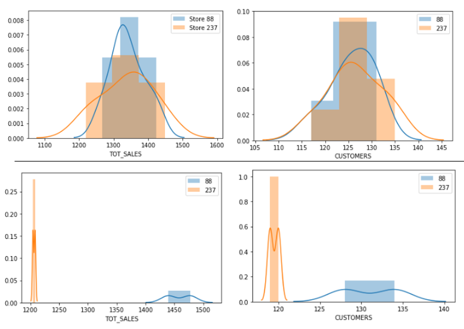

# Welcome to my Data Analytics Portfolio

# Hi, I'm Emil Roby!
A QA Engineer turned data analytics enthusiast, with a passion for transforming data into actionable insights. In this repository, you'll find a collection of my data analysis projects showcasing my skills and expertise in data manipulation, visualization, and interpretation.

## Skills
**Languages**
- Python, SQL, R

**Libraries & Tools**
- Pandas, NumPy, Matplotlib
- Jupyter Notebook, Power BI
- IBM Cognos Analytics, Google Looker Studio, Alteryx

**Other Skills**
- Data Cleaning and Preparation
- Exploratory Data Analysis
- Data Visualization

# Hands on Experience
## Job Simulation
I have done job simulations in some top comapnies through Forage:

 **Accenture, Data Analytics and Visualization (_June 2024_)**
 - Executed a simulated project advising a hypothetical social media client as a Data Analyst at Accenture.
 - Performed data cleaning, modeling, and analysis on 7 datasets to uncover insights into content trends to inform strategic decisions.
 - Crafted a PowerPoint deck and video presentation to communicate key insights for the client and internal stakeholders.

[Accenture Job Simulation final presentation](assets/Task_3_final_presentation.pptx)

**JP Morgan & Chase Co. Corporate Analyst Development Program (CADP) (_June 2024_)**
- Built a visualization dashboard using Tableau to analyze and present data effectively.
- Documented business processes and identified opportunities for improvement, communicating findings to relevant stakeholders.
- Developed a PowerPoint presentation to communicate key ideas and talking points, telling a compelling story through data.

[JP Morgan Mortgage Loan Dashboard](assets/JP_Morgan_Loan_Data_Tableau_Tempplate.png)

 **Quantium, Data Analytics (_June 2024_)**
 - Prepared transaction datasets for customer analytics using SQL and data manipulation techniques.
 - Generated data-driven commercial recommendations by extracting actionable insights from customer data using Python and R.
 - Identified benchmark stores for A/B testing of trial store layouts.
 - Created comprehensive reports informing strategic decisions for the Category Manager, leveraging data analysis skills.

[Project Report Pdf](codes/Task2_Quantium_Upliftment_testing.pdf)

Sales distribution during pretrial

# Education
B.Tech Electronics and Communication Engineering | Rajagiri School of Engineering and Technology, Kochi (_August 2018- June 2022_)

# Feel free to reach out to me:
- 📧 **Email**: [emilroby9@gmail.com](mailto:emilroby9@gmail.com)
- 🔗 **LinkedIn**: [Emil Roby's LinkedIn](https://www.linkedin.com/in/emil-roby-869798203/)
- 📞 **Phone**: +91 8301826142
